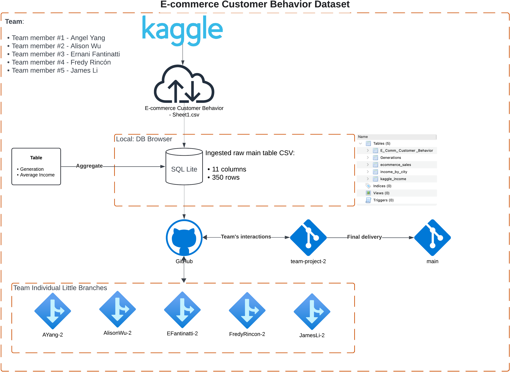

# Make sure it is 80%!

# TOC

# Explain project

- This project consists of the Customer Behaviour Dataset with its original 11 features and 350 rows. Other tables will compose the dataset, such as generations (synthetic ages based on actual years) and income average per city, as well as augmentation for Deep Learning usage and justification. The main goal is to test and evaluate our DL model in terms of accuracy, precision, recall, and train and test splits.
- Further git workflow will demonstrate our collaboration throughout this project.

 

# BE S.M.A.R.T.

**Specific:**

- The objective is to enhance the Customer Behaviour Dataset by integrating synthetic age generations and average income per city. We will apply data augmentation techniques to increase the size of the dataset.

- The objective is to utilize k means clustering algorithm to test our hypothesis about customer segmentation using the Customer Behaviour Dataset. We will apply hyperparameters tuning and cross validation techniques to ensure the model is optimized. Finally, we will evaluate the machine learning model's performance in terms of accuracy, precision, and recall.

**Measurable:**

-       Success will be measured by achieving a minimum accuracy of 85%, precision of 80%, and recall of 75% on the test split of the dataset. Additionally, the project will involve documenting the complete process and tracking collaboration using a Git workflow, which will include at least two pull requests per team member and one final merged repository with all contributions.
  **Achievable:**
-       Given the manageable size of the dataset (350 rows with 11 original features) and the team's expertise, this objective is realistic. The project will utilize existing tools and frameworks, and the team has the necessary skills to implement the required data augmentation, model evaluation, and Git workflow.
  **Relevant:**
- This objective is aligned with the broader goal of improving the team's capability in handling real-world customer behavior data and deploying DL models effectively. The project also demonstrates teamwork and version control practices, which are critical for collaborative data science projects.
  **Time-bound:**
- The project will be completed within 6 weeks. The first 2 weeks will be dedicated to dataset preparation and augmentation, followed by 3 weeks for model training, testing, and evaluation. The final week will be reserved for documentation, Git workflow validation, and final review.

### Final S.M.A.R.T. Objective Statement:

- "Within 6 weeks, we will enhance the Customer Behaviour Dataset by integrating synthetic data and augmenting it for deep learning. We will test and evaluate the deep learning model, aiming for at least 85% accuracy, 80% precision, and 75% recall. The entire process will be documented and tracked using a Git workflow to ensure collaborative success and version control adherence, culminating in a final merged repository."

# Diagram

Figure 1 - Workflow diagram.

# Figures machine-learning explanation

The data visualizations will be added once they are generated.

# Database explanation

- The customer behavior dataset has 350 rows and 11 columns.
- The dataset contains 6 numerical variables and 5 categorical variables. From the outputs we can see that all variables are stored in the correct data type, and that there are no null values in the dataset

- ## Data cleaning

* Check for missing values and handle them.
* Ensure data types are appropriate.
* Encode categorical variables if necessary.

- ## Data Engineering explanation

TBD? Translate categorical attributes into numerical values so the model can interpret the values correctly. For example, gender, city, membership type, satisfaction level and discount applied.

- ### Database expansion (more features)

To expand the database, we are considering to merge the main database table with income information based on city. We might be linking the city's median income with the membership type its residents hold.

- ### Database augmentation (add rows)

Based on customer's age, we will also cross-reference the different generations (Gen X, Gen Z, Millenials, etc.) based on the decades the customers were born.

- ## Feature Engineering

# Results

- ## Model parameters
  - ## Model accuracy
  - ## Overfit / Underfit
    - ### Explain the concepts
- ## Visuals output

# Future opportunities

### 1. **Feature Engineering and Enhancement:**

- **Temporal Features:** Incorporate time-series data, such as tracking customer behaviour over time, to predict future actions or trends.
- **Advanced Demographics:** Integrate more granular demographic data, such as education level, occupation, or household composition, to enrich the model's understanding.
- **Behavioral Features:** Track and include customer interaction data from various channels (e.g., website visits, social media engagement).

### 2. **Model Optimization and Experimentation:**

- **Hyperparameter Tuning:** Explore automated hyperparameter optimization techniques like Grid Search, Random Search, or Bayesian Optimization.
- **Model Ensemble:** Combine multiple models (e.g., Random Forest with Deep Learning) to improve performance potentially.
- **Transfer Learning:** Apply pre-trained models to new, related tasks with limited data. This is especially useful in scenarios with small datasets.

### 3. **Exploration of Different Deep Learning Architectures:**

- **Recurrent Neural Networks (RNNs):** Dealing with time-sequenced customer data, RNNs or LSTMs for more predictive power.
- **Convolutional Neural Networks (CNNs):** Consider using CNNs for pattern recognition in visual or spatial data.
- **Autoencoders:** Explore dimensionality reduction or anomaly detection within customer data.

### 4. **Data Augmentation and Synthetic Data Generation:**

- **Synthetic Data Creation:** Use Generative Adversarial Networks (GANs) to create more synthetic data to simulate various customer scenarios.
- **Simulated Customer Journeys:** Generate synthetic customer behaviour paths to test model robustness under different scenarios.

### 5. **Model Interpretability and Explainability:**

- **SHAP or LIME:** Implement SHAP (SHapley Additive exPlanations) or LIME (Local Interpretable Model-agnostic Explanations) to interpret the predictions of your deep learning model.
- **Ethical AI Practices:** Focus on creating explainable models to address ethical concerns, especially around customer privacy.

### 6. **Deployment and Real-Time Inference:**

- **Real-Time Prediction:** Implement the model for real-time customer behaviour prediction in production environments.
- **Edge Computing:** Deploy models on edge devices to predict customer behaviour in environments with limited connectivity.

### 7. **Integration with Other Technologies:**

- **Recommendation Systems:** Use customer behaviour insights to build or improve recommendation engines.
- **Sentiment Analysis:** Integrate NLP techniques to analyze customer feedback and refine the model based on customer sentiment.

### 8. **Cross-Domain Application:**

**Healthcare Analytics:** Apply the model architecture or techniques to other domains, such as healthcare, to predict patient behaviour.

- **Financial Fraud Detection:** Use the deep learning model for fraud detection by analyzing transaction behaviours.

### 9. **Continuous Learning and Model Updates:**

- **Lifelong Learning:** Implement systems that allow the model to learn continuously from new data without retraining from scratch.
- **Feedback Loops:** Create systems where the model's predictions can be validated with actual outcomes and improve over time.

### 10. **Collaboration and Open-Source Contributions:**

- **Open-Source Projects:** Contribute to or create open-source projects based on your work, enabling further community-driven improvements and collaborations.
- **Interdisciplinary Collaboration:** Work with other domains, such as psychology or sociology, to refine models based on human behaviour insights.
