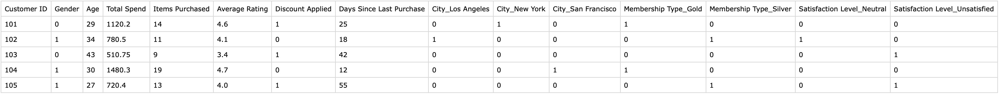
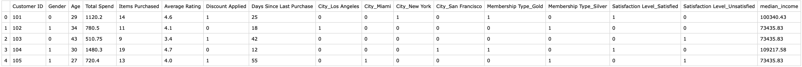
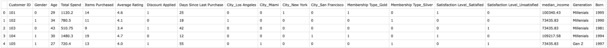

# Table of Contents

- [Table of Contents](#table-of-contents)
- [Explain project](#explain-project)
- [BE S.M.A.R.T.](#be-smart)
  - [Final S.M.A.R.T. Objective Statement:](#final-smart-objective-statement)
- [Diagram](#diagram)
- [Machine learning, Unsupervised Learning, K-Means Clustering](#machine-learning-unsupervised-learning-k-means-clustering)
- [Database explanation](#database-explanation)
- [Results](#results)
  - [KNN Model Parameters:](#knn-model-parameters)
  - [Layers:](#layers)
    - [Model Accuracy](#model-accuracy)
    - [Overfitting / Underfitting](#overfitting--underfitting)
- [Future opportunities](#future-opportunities)
  - [1. **Feature Engineering and Enhancement:**](#1-feature-engineering-and-enhancement)
  - [2. **Model Optimization and Experimentation:**](#2-model-optimization-and-experimentation)
  - [3a. **Exploration of Machine Learning:**](#3a-exploration-of-machine-learning)
  - [3b. **Exploration of Different Deep Learning Architectures:**](#3b-exploration-of-different-deep-learning-architectures)
  - [4. **Data Augmentation and Synthetic Data Generation:**](#4-data-augmentation-and-synthetic-data-generation)
  - [5. **Model Interpretability and Explainability:**](#5-model-interpretability-and-explainability)
  - [6. **Deployment and Real-Time Inference:**](#6-deployment-and-real-time-inference)
  - [7. **Integration with Other Technologies:**](#7-integration-with-other-technologies)
  - [8. **Cross-Domain Application:**](#8-cross-domain-application)
  - [9. **Continuous Learning and Model Updates:**](#9-continuous-learning-and-model-updates)
  - [10. **Collaboration and Open-Source Contributions:**](#10-collaboration-and-open-source-contributions)
  - [Videos:](#videos)

# Explain project

This project consists of the Customer Behaviour Dataset with its original 11 features and 350 rows. Other tables will compose the dataset, such as generations (synthetic ages based on actual years), income average per city, and augmentation for Deep Learning usage and justification. The main goal is to test and evaluate our DL model regarding accuracy, precision, recall, and train and test splits.

- Further git workflow will demonstrate our collaboration throughout this project.

<BR>

# BE S.M.A.R.T.

**Specific:**

The goals are:

- To enhance the Customer Behaviour Dataset by integrating synthetic age generations and average income per city. We will apply data augmentation techniques to increase the size of the dataset.

- (_Machine Learning, Unsupervised Learning_) To use the K-Means clustering algorithm to segment customers based on the Customer Behaviour Dataset. We will determine the optimal number of clusters through techniques like the Elbow method and Silhouette score. Finally, we will evaluate the segmentation quality using appropriate metrics such as inertia and silhouette score.

**Measurable:**

Success will be measured by achieving a minimum accuracy of 85%, precision of 80%, and recall of 75% on the dataset's test split. Additionally, the project will involve documenting the complete process and tracking collaboration using a Git workflow, which will include at least two pull requests per team member and one final merged repository with all contributions.

**Achievable:**

-       Given the manageable size of the dataset (350 rows with 11 original features) and the team's expertise, this objective is realistic. The project will utilize existing tools and frameworks, and the team has the necessary skills to implement the required data augmentation, model evaluation, and Git workflow.
  **Relevant:**
- This objective is aligned with the broader goal of improving the team's capability to handle real-world customer behaviour data and deploy DL models effectively. The project also demonstrates teamwork and version control practices, which are critical for collaborative data science projects.
  **Time-bound:**
- The project will be completed within 6 weeks. The first 2 weeks will be dedicated to dataset preparation and augmentation, followed by 3 weeks for model training, testing, and evaluation. The final week will be reserved for documentation, Git workflow validation, and final review.

### Final S.M.A.R.T. Objective Statement:

- "Within 6 weeks, we will enhance the Customer Behaviour Dataset by integrating synthetic data and augmenting it for deep learning. We will test and evaluate the deep learning model, aiming for at least 85% accuracy, 80% precision, and 75% recall. The entire process will be documented and tracked using a Git workflow to ensure collaborative success and version control adherence, culminating in a final merged repository."

# Diagram


Figure 1 - Workflow diagram.

# Machine learning, Unsupervised Learning, K-Means Clustering

- [Unsupervised Learning, K-Means Clustering](data/Code/Segmenting_Clients_Based_on_Buying_Habits.ipynb)

# Database explanation

- The customer behavior dataset has 350 rows and 11 columns.
- The dataset contains 6 numerical variables and 5 categorical variables. From the outputs, we can see that all variables are stored in the correct data type and that there are no null values in the dataset

- ## Data cleaning

* Check for missing values and handle them.
* Ensure data types are appropriate.
* Encode categorical variables if necessary.

  For this task, we will use the `sqllite3` library to load data from an SQLite3 database and `pandas` to perform ETL.

  ```python
  import sqlite3
  import pandas as pd

  # Connect to the SQLite database
  conn = sqlite3.connect('../sql/Customer_Behavior.db')

  # Define your SQL query
  query = "SELECT * FROM E_Comm_Customer_Behavior"

  # Use pandas to execute the query and read the data into a DataFrame
  df = pd.read_sql_query(query, conn)

  # Close the database connection
  conn.close()
  ```

- ## Data Engineering explanation

  - Translate categorical attributes into numerical values so the model can interpret the values correctly. For example, gender, city, membership type, satisfaction level and discount applied.

  ```python
  # Mapping Gender
  df['Gender'] = df['Gender'].map({'Male': 1, 'Female': 0})

  # Mapping Discount Applied
  df['Discount Applied'] = df['Discount Applied'].map({True: 1, False: 0})

  # One-hot encoding for City, Membership Type, and Satisfaction Level
  df = pd.get_dummies(df, columns=['City', 'Membership Type', 'Satisfaction Level'], drop_first=True)

  # Display the transformed DataFrame
  print(df.head())
  ```

  
  Figure 2 - Output.

- ### Database expansion (more features)

  - To expand the database, we consider merging the main database table with income information based on city. We might be linking the city's median income with the membership type its residents hold.

  ```python
  # Load the Income_by_City table
  query_income = "SELECT * FROM Income_by_City"
  df_income = pd.read_sql_query(query_income, conn)

  # Close the database connection
  conn.close()

  # Merge the DataFrames on the City column
  df_merged = pd.merge(df, df_income, on='City', how='left')

  # Display the merged DataFrame
  print(df_merged.head())
  ```

  
  Figure 3 - Output.

- ### Database augmentation (add rows)

Based on the customer's age, we will also cross-reference the different generations (Gen X, Gen Z, Millenials, etc.) based on the decades the customers were born.

```python
  # Merge the DataFrames
  df_augmented = pd.merge(df_merged, df_generations, on='Age', how='left')

  # Display the augmented DataFrame
  print(df_augmented.head())
```

- how='left': This ensures that all rows from the df_generations DataFrame are retained, even if there is no corresponding entry in the Income_by_City table.

  
  Figure 4 - Output.

* ## Feature Engineering

# Results

- ## Model parameters
  - ## Model accuracy
  - ## Overfit / Underfit
    - ### Explain the concepts
- ## Visuals output

```python
from sklearn.model_selection import train_test_split
from sklearn.preprocessing import StandardScaler, LabelEncoder
from sklearn.neighbors import KNeighborsRegressor
from sklearn.metrics import mean_squared_error, r2_score
import tensorflow as tf

# Encoding categorical variables
le_generation = LabelEncoder()
data['Generation'] = le_generation.fit_transform(data['Generation'])

# Dropping 'Customer ID' as it is not a useful feature and separating the target variable
target_column = 'median_income'
X = data.drop(['Customer ID', target_column], axis=1)
y = data[target_column]

# Splitting the data into train and test sets
X_train, X_test, y_train, y_test = train_test_split(X, y, test_size=0.2, random_state=42)

# Scaling the features
scaler = StandardScaler()
X_train_scaled = scaler.fit_transform(X_train)
X_test_scaled = scaler.transform(X_test)

# KNN Regression
knn = KNeighborsRegressor(n_neighbors=3)  # Adjusted to n_neighbors=3
knn.fit(X_train_scaled, y_train)
y_pred_knn = knn.predict(X_test_scaled)

# Evaluate KNN model
knn_mse = mean_squared_error(y_test, y_pred_knn)
knn_r2 = r2_score(y_test, y_pred_knn)

print(f'KNN Mean Squared Error: {knn_mse}')
print(f'KNN R^2 Score: {knn_r2}')

# Deep Learning Model
model = tf.keras.models.Sequential([
    tf.keras.layers.Dense(128, activation='relu', input_shape=(X_train.shape[1],)),
    tf.keras.layers.Dense(64, activation='relu'),
    tf.keras.layers.Dense(1)  # Linear activation for regression
])

model.compile(optimizer='adam', loss='mean_squared_error', metrics=['mean_squared_error', 'mae'])
history = model.fit(X_train_scaled, y_train, validation_split=0.2, epochs=30, batch_size=32)

# Predicting with the deep learning model
y_pred_dl = model.predict(X_test_scaled)

# Evaluating the deep learning model
dl_mse = mean_squared_error(y_test, y_pred_dl)
dl_r2 = r2_score(y_test, y_pred_dl)

print(f'Deep Learning Model Mean Squared Error: {dl_mse}')
print(f'Deep Learning Model R^2 Score: {dl_r2}')

```

## KNN Model Parameters:

- n_neighbors=5: The number of neighbours used in the KNN regression model.
  Algorithm: By default, KNN uses the 'auto' algorithm to decide the most appropriate method to compute the nearest neighbours.
  Distance Metric: By default, KNN uses the Euclidean distance to find the nearest neighbours.
  Deep Learning Model Parameters:

## Layers:

- Input Layer: Connected to 128 neurons with ReLU activation.
- Hidden Layer: 64 neurons with ReLU activation.
- Output Layer: 1 neuron with linear activation for regression output.
- Loss Function: Mean Squared Error (mean_squared_error) is the loss function appropriate for regression tasks.
- Optimizer: Adam optimizer is used, which is known for its efficiency and adaptive learning rate.
- Metrics: The model tracks mean_squared_error and mae (Mean Absolute Error) during training.

### Model Accuracy

KNN Model:

- Mean Squared Error (MSE): Measures the average of the squares of the errors—that is, the difference between the actual and predicted values.
  R² Score: This score indicates how well the model's predictions match the actual values. A score of 1 indicates perfect predictions, while a 0 indicates that the model does no better than a horizontal line.

Deep Learning Model:

- Mean Squared Error (MSE): Used to evaluate how well the model predicts the target values.
- R² Score: Used to assess the proportion of variance in the target variable that is predictable from the input features.

### Overfitting / Underfitting

- Overfitting:

- Occurs when a model learns the underlying patterns and noise in the training data, leading to poor generalization of new data.
- Symptoms include very low training error but significantly higher validation/test error.
- Indicators: In your deep learning model, if the validation MSE stops improving while the training MSE continues to decrease, this is a sign of overfitting.

Underfitting:

- Occurs when a model is too simple to capture the underlying structure of the data, leading to poor training and test data performance.
- Symptoms include both high training and test errors.
- Indicators: If both training and validation MSE are high and don’t decrease significantly during training, this suggests underfitting.<BR><BR>

# Future opportunities

### 1. **Feature Engineering and Enhancement:**

- **Temporal Features:** Incorporate time-series data, such as tracking customer behaviour over time, to predict future actions or trends.
- **Advanced Demographics:** Integrate more granular demographic data, such as education level, occupation, or household composition, to enrich the model's understanding.
- **Behavioral Features:** Track and include customer interaction data from various channels (e.g., website visits, social media engagement).

### 2. **Model Optimization and Experimentation:**

- **Hyperparameter Tuning:** Explore automated hyperparameter optimization techniques like Grid Search, Random Search, or Bayesian Optimization.
- **Model Ensemble:** Combine multiple models (e.g., Random Forest with Deep Learning) to improve performance potentially.
- **Transfer Learning:** Apply pre-trained models with limited data to new, related tasks. This is especially useful in scenarios with small datasets.

### 3a. **Exploration of Machine Learning:**

- [Unsupervised Learning, K-Means Clustering](data/Code/Segmenting_Clients_Based_on_Buying_Habits.ipynb)

### 3b. **Exploration of Different Deep Learning Architectures:**

- **Recurrent Neural Networks (RNNs):** Dealing with time-sequenced customer data, RNNs or LSTMs for more predictive power.
- **Convolutional Neural Networks (CNNs):** Consider using CNNs for pattern recognition in visual or spatial data.
- **Autoencoders:** Explore dimensionality reduction or anomaly detection within customer data.

### 4. **Data Augmentation and Synthetic Data Generation:**

- **Synthetic Data Creation:** Use Generative Adversarial Networks (GANs) to create more synthetic data to simulate various customer scenarios.
- **Simulated Customer Journeys:** Generate synthetic customer behaviour paths to test model robustness under different scenarios.

### 5. **Model Interpretability and Explainability:**

- **SHAP or LIME:** Implement SHAP (SHapley Additive exPlanations) or LIME (Local Interpretable Model-agnostic Explanations) to interpret the predictions of your deep learning model.
- **Ethical AI Practices:** Focus on creating explainable models to address ethical concerns, especially around customer privacy.

### 6. **Deployment and Real-Time Inference:**

- **Real-Time Prediction:** Implement the model for real-time customer behaviour prediction in production environments.
- **Edge Computing:** Deploy models on edge devices to predict customer behaviour in environments with limited connectivity.

### 7. **Integration with Other Technologies:**

- **Recommendation Systems:** Use customer behaviour insights to build or improve recommendation engines.
- **Sentiment Analysis:** Integrate NLP techniques to analyze customer feedback and refine the model based on customer sentiment.

### 8. **Cross-Domain Application:**

**Healthcare Analytics:** Apply the model architecture or techniques to other domains, such as healthcare, to predict patient behaviour.

- **Financial Fraud Detection:** Use the deep learning model for fraud detection by analyzing transaction behaviours.

### 9. **Continuous Learning and Model Updates:**

- **Lifelong Learning:** Implement systems that allow the model to learn continuously from new data without retraining from scratch.
- **Feedback Loops:** Create systems where the model's predictions can be validated with actual outcomes and improve over time.

### 10. **Collaboration and Open-Source Contributions:**

- **Open-Source Projects:** Contribute to or create open-source projects based on your work, enabling further community-driven improvements and collaborations.
- **Interdisciplinary Collaboration:** Work with other domains, such as psychology or sociology, to refine models based on human behaviour insights.

## Videos:

- [Alison Wu](https://your_url_here "Alison Wu's video")
- [Angel Yang](https://your_url_here "Angel Yang's video")
- [Ernani Fantinatti](https://youtu.be/9ckPH-sXSW0 "Ernani Fantinatti's video for Team Project 2")
- [Fredy L. Rincón](https://youtu.be/MoUIE0xfNag "Fredy Rincon's video for Team Project 2")
- [James Li](https://your_url_here "James Li's video")
